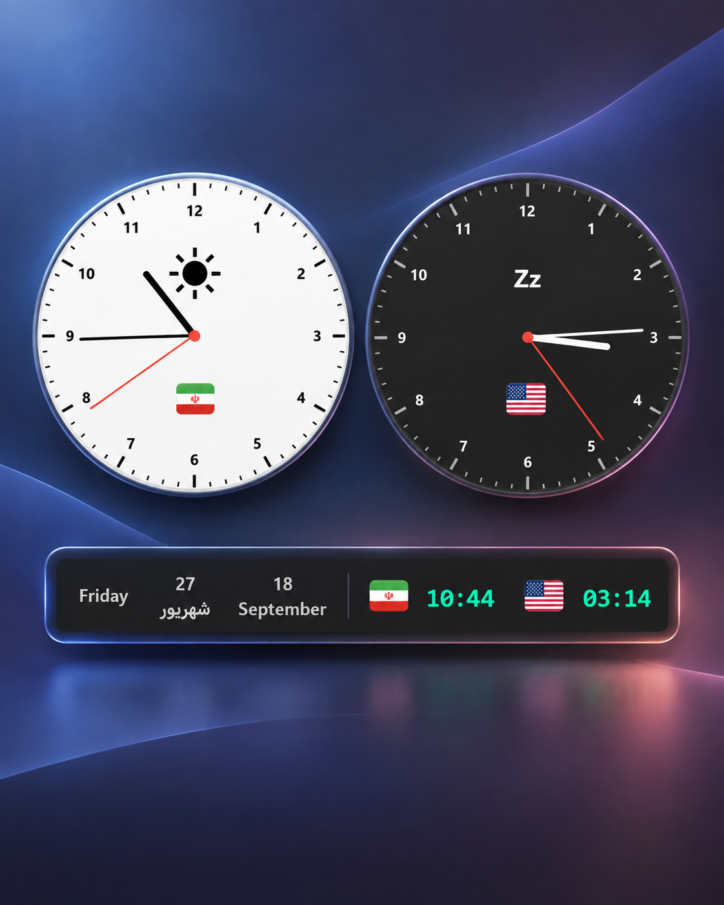

# Desktop Clocks

Two small, customizable multi-timezone clock widgets for Windows, built with Python and tkinter.

<p align="center">
  
</p>

## Files

- **`digital_clock.pyw`** – borderless, draggable, always-on-top digital clock showing several time zones (Iran, US, UK, Turkey, Japan) with flag icons and an optional Jalali (Persian) date. Right-click for Settings / Close.
- **`analog_clocks.pyw`** – two smooth, anti-aliased analog clocks (Iran & US) with day/night themes, adjustable size, and system tray support.

## Requirements

- Python 3.9+
- `pip install pillow`
- `pip install pystray` *(optional, analog clocks tray icon)*

## Usage

Double-click a `.pyw` file, or run:

```bash
pythonw digital_clock.pyw
pythonw analog_clocks.pyw
```

Right-click any clock to open its settings. Settings are saved automatically:

- Digital: `%APPDATA%\ClockWidget\config.json`
- Analog: `~/.analog_clocks_settings.json`

## Build an .exe (optional)

```bash
pip install pyinstaller
pyinstaller --onefile --noconsole --name ClockWidget digital_clock.pyw
```
